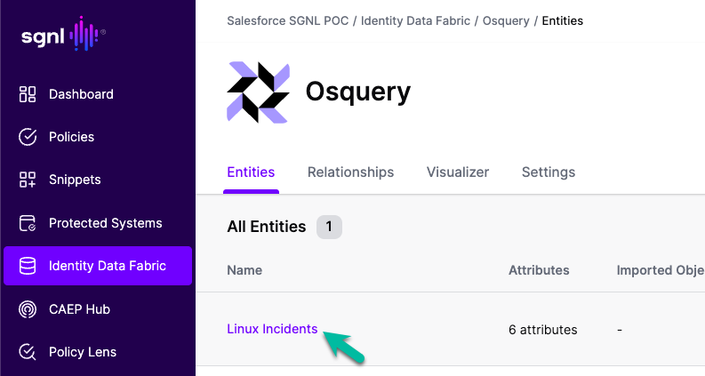
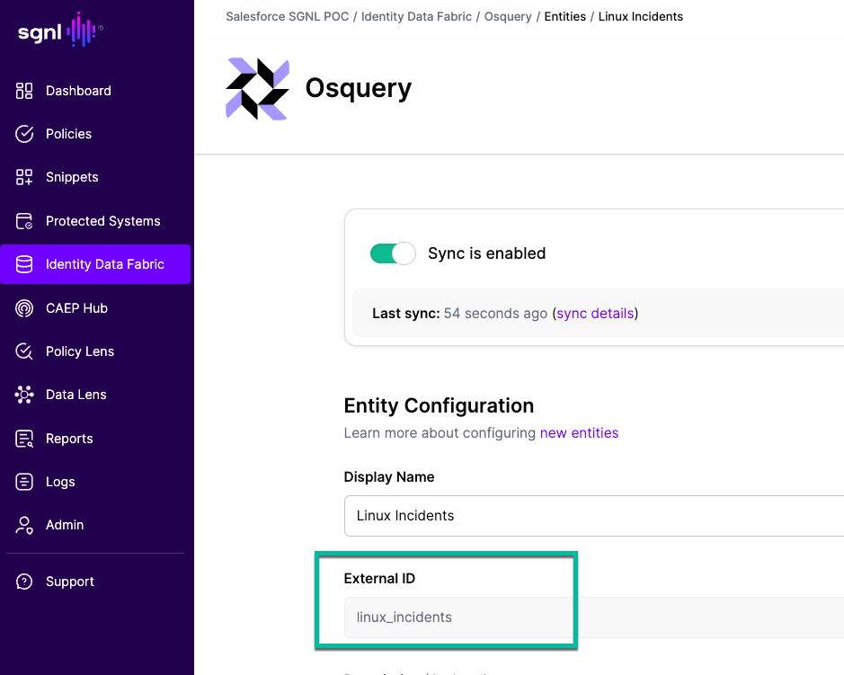
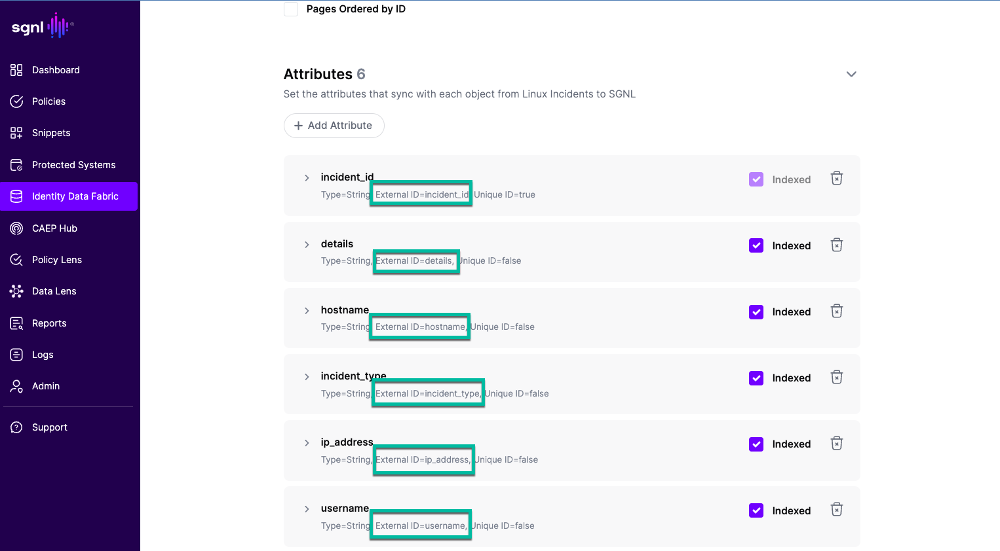

# SGNL Osquery System of Record Example

## Summary
This repo contains artifacts to create a SGNL Osquery System of Record (SoR) and artifacts to test it with an Amazon Linux 2023 server instance. 

## How It Works
Users can either run osqueries manually or schedule them on a machine. The output, formatted as CSV, is routed to an AWS S3 bucket. SGNL's AWS S3 Adapter is then used to ingest this data into the Identity Data Fabric. This adapter is leveraged by a custom System of Record for osquery. The [osquery.yml](sor/osquery/osquery.yml) template was created using SGNL’s System of Record [documentation](https://help.sgnl.ai/articles/systems-of-record/templates/?keyword=schema) as a reference.

## AWS S3 Setup
1. Create a S3 bucket used to collect osquery output
2. Record the name and region that bucket resides
3. Create an [AWS access key or IAM role](https://docs.aws.amazon.com/IAM/latest/UserGuide/id_credentials_access-keys.html) to use for authentication
    - Note: For the example below an AWS access key will be used

## Creating Osquery System of Record in SGNL

1. Click on "Identity Data Fabric" in your SGNL Client
2. Click on <a href="img/sor-1.png">"+Add"</a> at the top of the screen
3. Click "Create Custom SoR" in the lower right corner of the "Add System of Record" <a href="img/sor-2.png">dialog that appears</a>
4. Copy the contents of [osquery.yml](sor/osquery/osquery.yml) and paste them inside the <a href="img/sor-3.png">YAML text box that appears</a>
5. Click "Continue"
6. Scoll down to Authentication: username enter you AWS Access Key ID, for password enter your AWS Secret Access Key

## Generating Incidents on a AWS Linux 2023 Instance
1. SSH to your AWS Linux 2023 instance using the user account you intend to test with - that is, the user for whom incidents will be generated during the session
2. Copy the <a href="scripts/security_testing_script.sh">security_testing_script.sh</a> to your AWS Linux 2023 instance
3. Run the security_testing_script.sh in the background or if left in foreground open a second ssh instance to complete the next step
4. Run the following shell command:
    - Note: the name of the S3 bucket will need to be updated to the one you created in previous steps
        - `| aws s3 cp - s3://<your-s3-bucket-name>/linux_incidents.csv`
    - Note: the SGNL SoR osquery "Linux Incidents" entity is expecting a "linux_incidents.csv" in the S3 bucket

```
sudo osqueryi --csv --separator "," "WITH system_context AS (
    -- Get hostname
    SELECT hostname FROM system_info LIMIT 1
), 
network_context AS (
    -- Get primary IP address (excluding loopback)
    SELECT address as ip_address 
    FROM interface_addresses 
    WHERE interface != 'lo' 
      AND address NOT LIKE '127.%'
      AND address NOT LIKE '169.254.%'  -- Exclude APIPA
      AND address NOT LIKE 'fe80:%'     -- Exclude link-local IPv6
    ORDER BY interface 
    LIMIT 1
),
user_incidents AS (
    -- Suspicious files
    SELECT 
        'suspicious_file' as incident_type,
        u.username,
        f.path as details,
        datetime(f.ctime, 'unixepoch') as timestamp
    FROM file f
    JOIN users u ON f.uid = u.uid
    WHERE f.path LIKE '/tmp/%' 
      AND (f.filename LIKE '.%' OR f.filename LIKE '%suspicious%')
      AND f.ctime > (strftime('%s', 'now') - 3600)
    
    UNION ALL
    
    -- Suspicious processes
    SELECT 
        'suspicious_process' as incident_type,
        u.username,
        p.name || ': ' || p.cmdline as details,
        datetime(p.start_time, 'unixepoch') as timestamp
    FROM processes p
    JOIN users u ON p.uid = u.uid
    WHERE p.name IN ('svchost', 'nc', 'nmap')
       OR p.path LIKE '/tmp/%'
       OR p.cmdline LIKE '%python3 -m http.server%'
    
    UNION ALL
    
    -- Network connections
    SELECT 
        'network_connection' as incident_type,
        u.username,
        pos.local_address || ':' || pos.local_port || ' -> ' || pos.remote_address || ':' || pos.remote_port as details,
        datetime('now') as timestamp
    FROM process_open_sockets pos
    JOIN processes p ON pos.pid = p.pid
    JOIN users u ON p.uid = u.uid
    WHERE pos.remote_port IN (4444, 1337, 8080, 9999)
       OR pos.local_port > 8000
)
SELECT 
    printf('%s-%08d', 
           strftime('%Y%m%d%H%M%S', 'now'), 
           abs(random())
    ) as incident_id,
    sc.hostname,
    nc.ip_address,
    ui.incident_type,
    ui.username,
    ui.details,
    ui.timestamp
FROM user_incidents ui
CROSS JOIN system_context sc
CROSS JOIN network_context nc
ORDER BY ui.timestamp DESC;" | aws s3 cp - s3://sgnl-se-s3-bucket-sandbox/linux_incidents.csv
```

Sample of csv output can be found here: <a href="sor/osquery/csv/linux_incidents.csv">linux_incidents.csv</a>

## How SGNL Osquery SoR Interprets The CSV File and Inserts Into the Identity Graph

Before SGNL can process inbound data (whethere CSV, JSON from API) it leverages anchors in the data, which SGNL refers to as external IDs.  

Systems of Records leverage adpaters to retrieve data.  When the data is returned SGNL leverages anchors (referred to as <span style="color: #0066cc;">external IDs</span>) in the data to map to the entities and attributes defined.

Let's inspect Linux Incidents with the <a href="sor/osquery/osquery.yml">osquery SoR Template</a>.

<pre>
<code>
entities:
  Linux_Incidents:
    displayName: Linux Incidents
    <span style="color: #0066cc;">externalId: linux_incidents</span>
    description: Linux Incidents
    attributes:
      - name: incident_id
        <span style="color: #0066cc;">externalId: incident_id</span>
        type: String
        description: Incident ID
        indexed: true
        uniqueId: true
      - name: hostname
        <span style="color: #0066cc;">externalId: hostname</span>
        type: String
        description: Hostname
        indexed: true
      - name: ip_address
        <span style="color: #0066cc;">externalId: ip_address</span>
        type: String
        description: IP Address
        indexed: true
      - name: incident_type
        <span style="color: #0066cc;">externalId: incident_type</span>
        type: String
        description: Incident Type
        indexed: true
      - name: username
        <span style="color: #0066cc;">externalId: username</span>
        type: String
        description: Username
        indexed: true
      - name: details
        <span style="color: #0066cc;">externalId: details</span>
        type: String
        description: Details
        indexed: true
</code>
</pre>

When data for entities comes from CSV files - the name of the file must match the external ID of the entity.  In this example linux_incidents.csv.  

<a href="img/sor-4.png"></a></br>
<a href="img/sor-5.png"></a></br>

The CSV headers must match the external ID for each attribute:
`incident_id,hostname,ip_address,incident_type,username,details,timestamp`

<a href="img/sor-6.png"></a></br>